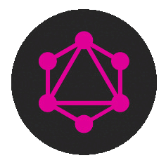

     
    

    
##    GraphQL & Microservices

 

Repositorio central para proyectos backend de tipo GraphQL y Microservicios. 

   

  * Lenguajes : Javascript, Typecript, GraphQL, otros.
  * Frameworks : NestJS, Express, otros.
  * Tecnologías : Nodejs, otras.
  * ORM : TypeORM, otros.
  * Bases de datos : MySQL, otras.
  * Bibliotecas : dotenv, cors, swagger, swagger-ui, otras.
  * Herramientas : Apollo, Vsc, Postman, Git, otras.

   
   
 
   

  
<!------Start Index----->

## Índice 📜

 
 Ver 

  

#### 🗂️ Projects
* [Microservicio para la gestión de dispositivos CISCO](#microservicio-para-la-gestion-de-dispositivos-cisco-)

  

    
    
    
    
    
    
    
  

 

<!------Stop Index----->
  
  
 
  
 

 <!------MICROSERVICIO CISCO GRAPHQL------>
 

  
 ### Microservicio para la gestión de dispositivos CISCO. [🔝](#índice-)
 

    
    
    
    
    
    
    

 

 ### Details

  
  

<!------FIN MICROSERVICIO CISCO GRAPHQL------>

  
 
 
 
 
 
 
